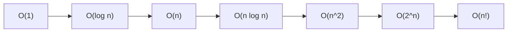

# Chapitre 1 — Complexité algorithmique

## 1.1 Pourquoi mesurer la complexité ?

Un algorithme peut résoudre un problème de dizaines de façons différentes. La **complexité algorithmique** permet de comparer ces solutions indépendamment du matériel ou du langage, en répondant à deux questions :

- **Temps** : combien d'opérations l'algorithme effectue-t-il en fonction de la taille des données ?
- **Espace** : combien de mémoire supplémentaire consomme-t-il ?

---

## 1.2 La notation Big O

La notation **Big O** (O majuscule) exprime une borne supérieure asymptotique. Elle décrit le comportement dans le **pire cas** quand n → ∞, en ignorant les constantes et les termes dominés.

```
f(n) = 3n² + 5n + 12  →  O(n²)
f(n) = 2 log n + 100  →  O(log n)
f(n) = 7              →  O(1)
```

### Règles de simplification

| Règle | Exemple |
|-------|---------|
| Ignorer les constantes | O(3n) → O(n) |
| Ignorer les termes non-dominants | O(n² + n) → O(n²) |
| Addition : boucles séquentielles | O(n) + O(m) = O(n + m) |
| Multiplication : boucles imbriquées | O(n) × O(m) = O(n·m) |

---

## 1.3 Les complexités courantes



| Complexité | Nom | n=10 | n=100 | n=1 000 |
|-----------|-----|------|-------|---------|
| O(1) | Constante | 1 | 1 | 1 |
| O(log n) | Logarithmique | 3 | 7 | 10 |
| O(n) | Linéaire | 10 | 100 | 1 000 |
| O(n log n) | Log-linéaire | 33 | 664 | 9 966 |
| O(n²) | Quadratique | 100 | 10 000 | 1 000 000 |
| O(2ⁿ) | Exponentielle | 1 024 | 10³⁰ | ∞ |
| O(n!) | Factorielle | 3 628 800 | ∞ | ∞ |

---

## 1.4 Exemples PHP annotés

```php
<?php
declare(strict_types=1);

// ─────────────────────────────────────────────────────────
// O(1) — Temps constant : indépendant de la taille du tableau
// ─────────────────────────────────────────────────────────
function getFirst(array $arr): mixed
{
    return $arr[0] ?? null;  // Une seule opération, toujours
}

function isEven(int $n): bool
{
    return $n % 2 === 0;     // Toujours une opération
}


// ─────────────────────────────────────────────────────────
// O(log n) — Logarithmique : on divise le problème par 2
// ─────────────────────────────────────────────────────────
function binarySearch(array $sorted, int $target): int
{
    $left  = 0;
    $right = count($sorted) - 1;

    while ($left <= $right) {
        $mid = intdiv($left + $right, 2);   // pivot central

        if ($sorted[$mid] === $target) {
            return $mid;
        }
        if ($sorted[$mid] < $target) {
            $left = $mid + 1;               // ignore la moitié gauche
        } else {
            $right = $mid - 1;              // ignore la moitié droite
        }
    }
    return -1;
}

// Pour n=1 000 000, au max ~20 itérations (log₂ 1 000 000 ≈ 20)


// ─────────────────────────────────────────────────────────
// O(n) — Linéaire : on visite chaque élément une fois
// ─────────────────────────────────────────────────────────
function findMax(array $arr): int|float
{
    $max = PHP_INT_MIN;
    foreach ($arr as $v) {          // n itérations
        if ($v > $max) $max = $v;
    }
    return $max;
}

function linearSearch(array $arr, mixed $target): int
{
    foreach ($arr as $i => $v) {    // pire cas : n comparaisons
        if ($v === $target) return $i;
    }
    return -1;
}


// ─────────────────────────────────────────────────────────
// O(n log n) — Tri fusion : diviser + fusionner
// ─────────────────────────────────────────────────────────
function mergeSort(array $arr): array
{
    $n = count($arr);
    if ($n <= 1) return $arr;           // cas de base

    $mid   = intdiv($n, 2);
    $left  = mergeSort(array_slice($arr, 0, $mid));     // log n niveaux
    $right = mergeSort(array_slice($arr, $mid));

    return mergeSorted($left, $right);                  // O(n) par niveau
}

function mergeSorted(array $left, array $right): array
{
    $result = [];
    $i = $j = 0;

    while ($i < count($left) && $j < count($right)) {
        if ($left[$i] <= $right[$j]) {
            $result[] = $left[$i++];
        } else {
            $result[] = $right[$j++];
        }
    }
    // Ajouter les restes
    while ($i < count($left))  $result[] = $left[$i++];
    while ($j < count($right)) $result[] = $right[$j++];

    return $result;
}


// ─────────────────────────────────────────────────────────
// O(n²) — Quadratique : deux boucles imbriquées
// ─────────────────────────────────────────────────────────
function bubbleSort(array $arr): array
{
    $n = count($arr);
    for ($i = 0; $i < $n - 1; $i++) {          // n-1 passes
        for ($j = 0; $j < $n - $i - 1; $j++) { // n-i-1 comparaisons
            if ($arr[$j] > $arr[$j + 1]) {
                [$arr[$j], $arr[$j + 1]] = [$arr[$j + 1], $arr[$j]];
            }
        }
    }
    return $arr;
}

function hasDuplicates(array $arr): bool
{
    $n = count($arr);
    for ($i = 0; $i < $n; $i++) {
        for ($j = $i + 1; $j < $n; $j++) { // toutes les paires
            if ($arr[$i] === $arr[$j]) return true;
        }
    }
    return false;
}


// ─────────────────────────────────────────────────────────
// O(2ⁿ) — Exponentielle : chaque appel crée 2 sous-appels
// ─────────────────────────────────────────────────────────
function fibNaif(int $n): int
{
    if ($n <= 1) return $n;
    return fibNaif($n - 1) + fibNaif($n - 2);  // arbre de récursion
}
// fibNaif(50) : ~2^50 appels ≈ 10^15 → inutilisable !

// ─────────────────────────────────────────────────────────
// O(n!) — Factorielle : toutes les permutations
// ─────────────────────────────────────────────────────────
function permutations(array $arr, array $current = []): array
{
    if (empty($arr)) return [$current];

    $result = [];
    foreach ($arr as $i => $v) {
        $rest    = array_values(array_filter($arr, fn($k) => $k !== $i, ARRAY_FILTER_USE_KEY));
        $result  = array_merge($result, permutations($rest, [...$current, $v]));
    }
    return $result;
}
// permutations([1,2,3,4,5,6,7,8,9,10]) → 10! = 3 628 800 résultats
```

---

## 1.5 Complexité spatiale

La complexité spatiale mesure la mémoire **supplémentaire** utilisée (hors données d'entrée).

```php
<?php
declare(strict_types=1);

// O(1) espace — on ne crée pas de nouvelle structure
function sumArray(array $arr): int
{
    $sum = 0;                       // une seule variable
    foreach ($arr as $v) $sum += $v;
    return $sum;
}

// O(n) espace — on crée un tableau de taille n
function doubled(array $arr): array
{
    $result = [];
    foreach ($arr as $v) $result[] = $v * 2;   // n éléments
    return $result;
}

// O(n) espace — pile d'appels récursifs
function factorielle(int $n): int
{
    if ($n <= 1) return 1;
    return $n * factorielle($n - 1);    // n frames sur la pile
}

// O(log n) espace — mergeSort (pile de profondeur log n)
// mais O(n) si on compte les tableaux temporaires créés
```

---

## 1.6 Meilleur cas, cas moyen, pire cas

| Notation | Signification | Exemple |
|----------|---------------|---------|
| **O(...)** | Borne supérieure (pire cas) | Big O — le plus utilisé |
| **Ω(...)** | Borne inférieure (meilleur cas) | Big Omega |
| **Θ(...)** | Borne exacte (cas moyen = pire) | Big Theta |

```php
<?php
declare(strict_types=1);

// Recherche linéaire :
//  Meilleur cas Ω(1)  — cible en position 0
//  Pire cas     O(n)  — cible absente ou en dernière position
//  Cas moyen    Θ(n/2) = Θ(n)

function search(array $arr, mixed $target): int
{
    foreach ($arr as $i => $v) {
        if ($v === $target) return $i;  // peut s'arrêter tôt
    }
    return -1;
}

// Tri rapide (Quick Sort) :
//  Meilleur cas  Ω(n log n) — pivot toujours médian
//  Pire cas      O(n²)      — tableau déjà trié, pivot = min/max
//  Cas moyen     Θ(n log n) — pivot aléatoire
```

---

## 1.7 Règles pratiques

!!! tip "Règles d'or"
    1. **Une boucle simple** → O(n)
    2. **Deux boucles imbriquées** → O(n²)
    3. **Diviser par 2 à chaque étape** → O(log n)
    4. **Boucle + récursion divisant par 2** → O(n log n)
    5. **Récursion avec deux appels** → souvent O(2ⁿ)

!!! warning "Piège courant"
    ```php
    // Ceci est O(n²), PAS O(n) !
    $n = count($arr);
    for ($i = 0; $i < $n; $i++) {
        if (in_array($arr[$i], $arr)) {  // in_array = O(n) à l'intérieur
            // ...
        }
    }

    // Solution O(n) : utiliser un tableau associatif (hash)
    $seen = [];
    foreach ($arr as $v) {
        if (isset($seen[$v])) { /* trouvé */ }
        $seen[$v] = true;       // O(1) amortis
    }
    ```

---

## Exercices

!!! exercise "Exercice 1.1"
    Quelle est la complexité de cette fonction ? Expliquez.
    ```php
    function mystery(int $n): int {
        $count = 0;
        for ($i = $n; $i > 0; $i = intdiv($i, 2)) {
            for ($j = 0; $j < $n; $j++) {
                $count++;
            }
        }
        return $count;
    }
    ```
    ??? success "Réponse"
        O(n log n) — la boucle externe s'exécute log n fois (on divise par 2), la boucle interne s'exécute n fois.

!!! exercise "Exercice 1.2"
    Améliorez `hasDuplicates()` de O(n²) à O(n). Utilisez un tableau associatif.
    ??? success "Réponse"
        ```php
        function hasDuplicatesFast(array $arr): bool
        {
            $seen = [];
            foreach ($arr as $v) {
                if (isset($seen[$v])) return true;
                $seen[$v] = true;
            }
            return false;
        }
        // O(n) temps, O(n) espace
        ```

!!! exercise "Exercice 1.3"
    Écrivez une fonction qui calcule la somme de tous les sous-tableaux possibles d'un tableau de taille n. Quelle est sa complexité ? Peut-on faire mieux ?
